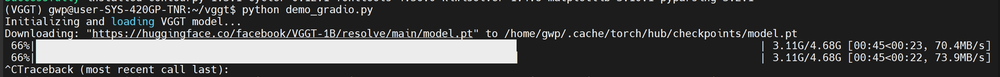
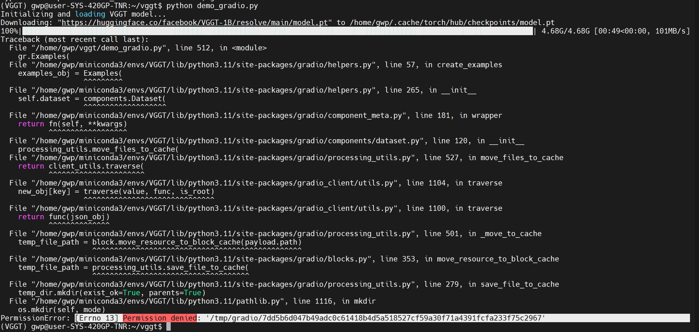

<div align="center">
<h1>测试 （CVPR 2025）VGGT: Visual Geometry Grounded Transformer</h1>
</div>

## 配置测试
```bash
git clone https://github.com/KwanWaiPang/vggt.git
cd vggt

# 创建虚拟环境
conda create -n VGGT python=3.11
conda activate VGGT
# conda remove --name VGGT --all

pip install -r requirements.txt
```

* 安装可视化工具
```bash
pip install -r requirements_demo.txt
```

* 下载模型[link](https://huggingface.co/facebook/VGGT-1B/resolve/main/model.pt)

* 运行demo
```bash
conda activate VGGT
pip install matplotlib

python demo_gradio.py
```
运行后似乎会自动下载前面下载好的模型，因此手动下载过就注释掉就可以了吧（但测试的时候发现会报错，那还是直接重新下载算了~）

<div align="center">
  
<figcaption>  
</figcaption>
</div>

最终有权限类的错误

<div align="center">
  
<figcaption>  
</figcaption>
</div>

尝试采用下面的visualization
```bash
python demo_viser.py --image_folder path/to/your/images/folder
```


* 也可以采用在线的damo [Link](https://huggingface.co/spaces/facebook/vggt) 早说嘛，我就懒得配置了😂

* 在[原readme](./README%20original.md)中也从代码角度介绍了每个模块大致怎么使用